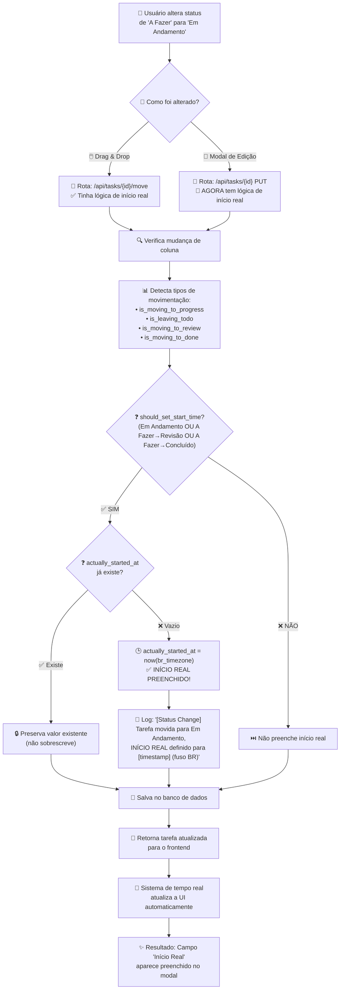

# 🕒 Correção: Preenchimento Automático do Início Real

## 🎯 Problema Identificado

O campo **"Início Real"** não estava sendo preenchido automaticamente quando uma tarefa era alterada de **"A Fazer"** para **"Em Andamento"** através do modal de edição da tarefa.

### ❌ **Situação Anterior**
- ✅ Funcionava: Drag & drop entre colunas (rota `/api/tasks/<id>/move`)
- ❌ **Não funcionava**: Alteração via modal de edição (rota `/api/tasks/<id>` PUT)

### 🔍 **Causa do Problema**

Existiam **duas rotas diferentes** para atualizar tarefas:

1. **`/api/tasks/<id>/move`** (drag & drop entre colunas)
   - ✅ **Tinha** lógica de preenchimento automático do `actually_started_at`

2. **`/api/tasks/<id>`** PUT (modal de edição)
   - ❌ **Não tinha** lógica de preenchimento automático

## ✅ **Solução Implementada**

### **Adicionada lógica completa na rota PUT**

#### **Arquivo**: `app/backlog/routes.py` - Linha 571
```python
if 'status' in data:
    try:
        status_id = int(data['status'])
        if status_id in status_map:
            # 🎯 NOVA LÓGICA: Verifica mudança de status
            old_column_name = task.column.name.upper() if task.column else ''
            new_column_name = status_map[status_id].upper()
            
            # Detecta tipos de movimentação
            is_moving_to_progress = new_column_name == 'EM ANDAMENTO'
            is_leaving_todo = old_column_name == 'A FAZER'
            is_moving_to_review = new_column_name == 'REVISÃO'
            is_moving_to_done = new_column_name == 'CONCLUÍDO'
            
            # Preenche actually_started_at quando:
            # 1. Move para "Em Andamento" OU
            # 2. Move diretamente de "A Fazer" para "Revisão" OU  
            # 3. Move diretamente de "A Fazer" para "Concluído"
            should_set_start_time = (
                is_moving_to_progress or 
                (is_leaving_todo and is_moving_to_review) or
                (is_leaving_todo and is_moving_to_done)
            )
            
            if not task.actually_started_at and should_set_start_time:
                task.actually_started_at = datetime.now(br_timezone)
                # Log detalhado para auditoria
                
            # Preenche completed_at quando move para "Concluído"
            if is_moving_to_done and not task.completed_at:
                task.completed_at = datetime.now(br_timezone)
```

## 🎯 **Como Funciona Agora**

### **Cenários de Preenchimento Automático**

1. **A Fazer → Em Andamento**
   - ✅ **Início Real**: Preenchido automaticamente
   - ✅ **Data de Conclusão**: Não alterada

2. **A Fazer → Revisão** (pulo direto)
   - ✅ **Início Real**: Preenchido automaticamente
   - ✅ **Data de Conclusão**: Não alterada

3. **A Fazer → Concluído** (pulo direto)
   - ✅ **Início Real**: Preenchido automaticamente
   - ✅ **Data de Conclusão**: Preenchida automaticamente

4. **Em Andamento → Concluído**
   - ✅ **Início Real**: Mantido (já existe)
   - ✅ **Data de Conclusão**: Preenchida automaticamente

### **Características da Implementação**

#### **🛡️ Proteção Contra Sobrescrita**
- **Nunca sobrescreve** datas existentes
- **Só preenche** se campo estiver vazio
- **Preserva** dados manuais do usuário

#### **🕐 Fuso Horário Correto**
- **Usa `datetime.now(br_timezone)`**
- **Horário de Brasília** em todas as operações
- **Consistente** com correção anterior de fuso

#### **📊 Logs Detalhados**
```
[Status Change] Tarefa 12753: 'A FAZER' -> 'EM ANDAMENTO'
[Status Change] Tarefa 12753 movida para Em Andamento, INÍCIO REAL definido para 2025-01-04 14:30:45 (fuso BR)
```

## 🧪 **Teste da Correção**

### **Passos para Testar**

1. **Crie uma tarefa** em "A Fazer"
2. **Abra o modal** de edição da tarefa  
3. **Mude o Status** para "Em Andamento"
4. **Clique em "Salvar Alterações"**
5. **Reabra o modal** da tarefa
6. **Verifique** se "Início Real" foi preenchido automaticamente

### **Resultado Esperado**
- ✅ Campo "Início Real" preenchido com data/hora atual
- ✅ Horário no fuso de Brasília
- ✅ Log no console do servidor confirmando a operação

## 📋 **Cenários Cobertos**

### **✅ Funcionam Perfeitamente**

| **Operação** | **Drag & Drop** | **Modal Edit** |
|--------------|-----------------|----------------|
| A Fazer → Em Andamento | ✅ | ✅ |
| A Fazer → Revisão | ✅ | ✅ |
| A Fazer → Concluído | ✅ | ✅ |
| Em Andamento → Concluído | ✅ | ✅ |
| Qualquer → A Fazer | ✅ | ✅ |

### **🔐 Proteções Implementadas**

- **Não sobrescreve** datas existentes
- **Validação** de tipos de dados
- **Tratamento** de erros de conversão
- **Logs auditáveis** para debugging

## 🎉 **Resultado Final**

**Agora o sistema funciona de forma consistente:**

1. ✅ **Drag & drop** entre colunas → Início Real preenchido
2. ✅ **Edição via modal** → Início Real preenchido
3. ✅ **Ambos usam fuso horário correto** (Brasília)
4. ✅ **Proteção contra sobrescrita** de dados existentes
5. ✅ **Logs detalhados** para auditoria
6. ✅ **Data de Conclusão** também preenchida automaticamente

**O campo "Início Real" agora é preenchido automaticamente independente de como você altera o status da tarefa!** 🎯

## 🧪 **Comandos de Teste**

### **Console do Navegador:**
```javascript
// Executa todos os testes automatizados
testInicioReal()

// Simula mudança de status específica
simulateStatusChange(taskId, columnId)

// Mostra exemplos de uso da API
showApiUsage()
```

### **URL de Teste Automático:**
```
/sprints?debug=inicio-real
```
- Executa testes automaticamente ao carregar a página
- Relatório completo no console do navegador

## 🎯 **Fluxo Completo do Sistema**

O diagrama abaixo mostra como o sistema funciona agora com todas as correções implementadas:



## 📋 **Resumo das Implementações**

### **1. Sistema de Tempo Real** ✅
- Sincronização automática entre módulos
- Polling adaptativo baseado em atividade
- Detecção de mudanças em tempo real

### **2. Correção de Fuso Horário** ✅
- Padronização para horário de Brasília
- Função `get_brasilia_now()` centralizada
- Consistência em todos os campos de data

### **3. Atualização Imediata de Sprints** ✅
- Re-renderização automática de cards
- Reativação de event listeners
- Funcionalidade completa sem reload

### **4. Preenchimento Automático de Início Real** ✅
- Funciona via drag & drop
- Funciona via modal de edição
- Proteção contra sobrescrita
- Logs detalhados para auditoria

**🎉 RESULTADO: Sistema completamente funcional e em tempo real!** 