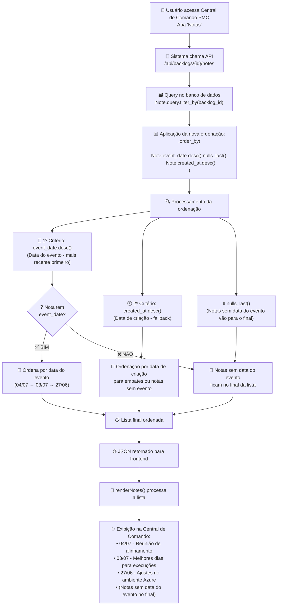

# 📅 Ordenação de Notas por Data do Evento - Central de Comando PMO

## 🎯 **Problema Identificado**

Na **Central de Comando PMO**, as notas estavam sendo exibidas ordenadas por **data de criação** em vez de **data do evento**, resultando em uma ordem cronológica incorreta dos eventos do projeto.

### ❌ **Situação Anterior**
- Ordenação: `Note.created_at.desc()` (data de criação)
- Resultado: Notas apareciam na ordem que foram inseridas no sistema
- Problema: Cronologia dos eventos ficava confusa

### 🎯 **Situação Desejada**
- Ordenação: `Note.event_date.desc()` (data do evento) com fallback para `created_at`
- Resultado: Eventos organizados cronologicamente por quando aconteceram
- Exemplo correto: 27/06, 03/07, 04/07 (independente de quando foram cadastrados)

## ✅ **Solução Implementada**

### **Ordenação Inteligente**
```python
# Nova ordenação aplicada em todas as APIs de notas
.order_by(
    Note.event_date.desc().nulls_last(),  # 1º: Data do evento (mais recente primeiro)
    Note.created_at.desc()                # 2º: Fallback para data de criação
)
```

### **Lógica de Funcionamento**
1. **Prioridade**: Ordena por `event_date` (data do evento)
2. **Mais recente primeiro**: `.desc()` (ordem decrescente)
3. **Fallback inteligente**: `.nulls_last()` - notas sem data do evento vão para o final
4. **Critério secundário**: `created_at` como backup para empates ou notas sem data do evento

## 📂 **Arquivos Modificados**

### **1. API Principal de Notas do Backlog**
**Arquivo**: `app/backlog/note_routes.py` - Linha 17-21
```python
@backlog_bp.route('/api/backlogs/<int:backlog_id>/notes', methods=['GET'])
def get_backlog_notes(backlog_id):
    notes = Note.query.filter_by(backlog_id=backlog_id).order_by(
        Note.event_date.desc().nulls_last(),
        Note.created_at.desc()
    ).all()
```

### **2. API Geral de Notas**
**Arquivo**: `app/backlog/note_routes.py` - Linha 41-45
```python
@backlog_bp.route('/api/notes', methods=['GET'])
def get_notes():
    notes = query.order_by(
        Note.event_date.desc().nulls_last(),
        Note.created_at.desc()
    ).all()
```

### **3. API de Notas de Tarefas**
**Arquivo**: `app/backlog/note_routes.py` - Linha 248-252
```python
@backlog_bp.route('/api/tasks/<int:task_id>/notes', methods=['GET'])
def get_task_notes(task_id):
    notes = Note.query.filter_by(task_id=task_id).order_by(
        Note.event_date.desc().nulls_last(),
        Note.created_at.desc()
    ).all()
```

### **4. Status Report (MacroService)**
**Arquivo**: `app/macro/services.py` - Linha 4116-4120
```python
project_notes = Note.query.filter_by(
    backlog_id=backlog_id, 
    include_in_status_report=True
).order_by(
    Note.event_date.desc().nulls_last(),
    Note.created_at.desc()
).all()
```

### **5. Relatórios de Notas**
**Arquivo**: `app/backlog/note_routes.py` - Linhas 344 e 413
- API de prévia de relatório
- API de geração de relatório completo

## 🎯 **Como Funciona na Prática**

### **Exemplo Real**

**Notas cadastradas:**
1. **Criada**: 05/01/2025 → **Evento**: 27/06/2023 → "Ajustes no acesso ao ambiente Azure"
2. **Criada**: 04/01/2025 → **Evento**: 04/07/2023 → "Reunião de alinhamento Fabric e PBI"
3. **Criada**: 03/01/2025 → **Evento**: 03/07/2023 → "Melhores dias para execuções"

**Ordenação Anterior** (por data de criação):
```
1. 05/01 → Evento 27/06 ❌ (mais recente criação primeiro)
2. 04/01 → Evento 04/07 ❌
3. 03/01 → Evento 03/07 ❌
```

**Ordenação Nova** (por data do evento):
```
1. 04/07 → Reunião de alinhamento ✅ (evento mais recente primeiro)
2. 03/07 → Melhores dias para execuções ✅
3. 27/06 → Ajustes no ambiente Azure ✅
```

### **Casos Especiais**

#### **Notas sem Data do Evento**
- Ficam no **final da lista** (`.nulls_last()`)
- Ordenadas por **data de criação** entre si
- Não interferem na cronologia dos eventos

#### **Múltiplas Notas na Mesma Data**
- Ordenadas por **data de criação** como critério de desempate
- Mantém consistência na visualização

## 🧪 **Como Testar**

### **Teste Manual**
1. Acesse a **Central de Comando PMO**
2. Vá para a aba **"Notas"**
3. Verifique se as notas estão ordenadas por **data do evento**
4. As datas dos eventos devem aparecer em ordem decrescente

### **Teste com Novas Notas**
1. Crie uma nota com data do evento **anterior** à última
2. A nota deve aparecer **depois** das notas com eventos mais recentes
3. Independente de quando foi criada

### **Teste com Notas Sem Data**
1. Crie uma nota **sem preencher** a data do evento
2. Deve aparecer no **final da lista**
3. Ordenada por data de criação junto com outras sem data do evento

## 🎉 **Resultado Final**

### **✅ Benefícios Implementados**

1. **Cronologia Correta**: Eventos organizados por quando realmente aconteceram
2. **Ordem Intuitiva**: Mais recente primeiro, independente de quando foi cadastrado
3. **Flexibilidade**: Funciona com ou sem data do evento
4. **Consistência**: Mesma lógica em todas as APIs do sistema
5. **Fallback Inteligente**: Usa data de criação quando data do evento não existe

### **📊 Comparação**

| **Aspecto** | **Antes** | **Depois** |
|-------------|-----------|------------|
| **Critério Principal** | Data de criação | Data do evento |
| **Ordem** | Inserção no sistema | Cronologia real |
| **Intuitividade** | ❌ Confuso | ✅ Lógico |
| **Flexibilidade** | ❌ Rígido | ✅ Adaptativo |
| **Consistência** | ❌ Parcial | ✅ Total |

## 🎯 **Fluxo Completo do Sistema**

O diagrama abaixo mostra como funciona a nova ordenação:



## 🧪 **Comandos de Teste**

### **Console do Navegador:**
```javascript
// Executa todos os testes de ordenação
testNotasOrdenacao()

// Cria nota para teste específico
simulateNoteCreation("2023-06-27", "Nota de teste")
```

### **URL de Teste Automático:**
```
/board/[PROJECT_ID]?debug=notas-ordenacao
```
- Executa testes automaticamente ao carregar a página
- Relatório completo no console do navegador

**🎯 Agora a Central de Comando PMO exibe os eventos na ordem cronológica correta, facilitando o acompanhamento da evolução do projeto!** 